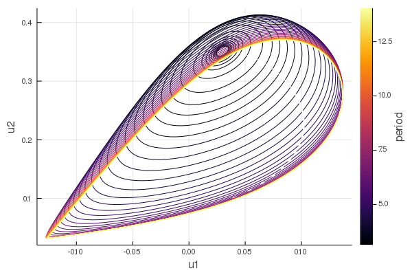
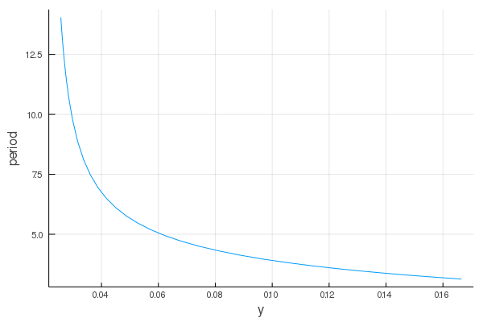

<a id='Modified-Morris-Lecar-model-1'></a>

# Modified Morris-Lecar model


Modified Morris-Lecar model from [Dhooge, Govaerts, Kuznetsov (2003)]:


  * [Dhooge, Govaerts, Kuznetsov (2003)]. Numerical Continuation of Fold Bifurcations of Limit Cycles in MATCONT


[Dhooge, Govaerts, Kuznetsov (2003)]: https://doi.org/10.1007/3-540-44860-8_72


```julia
using Bifurcations
using Bifurcations: special_intervals
using Bifurcations.Codim1
using Bifurcations.Codim2
using Bifurcations.Codim2LimitCycle: FoldLimitCycleProblem
using Bifurcations.Examples: MorrisLecar

using Setfield: @lens
using Plots
```


Solve continuation of the equilibrium point:


```julia
solver = init(
    MorrisLecar.make_prob();
    start_from_nearest_root = true,
    max_branches = 0,
    nominal_angle_rad = 2π * (5 / 360),
)
@time solve!(solver)
```

```
  1.295154 seconds (1.72 M allocations: 92.824 MiB, 6.77% gc time)
Codim1Solver <Continuous>
# sweeps             : 2
# points             : 41
# branches           : 0
# saddle_node        : 2
# hopf               : 1
```


Plot equilibriums in $(u_1, y)$-space:


```julia
plt1 = plot(solver)
```


<a id='Start-continuation-of-Hopf-bifurcation-1'></a>

### Start continuation of Hopf bifurcation


```julia
hopf_point, = special_intervals(solver, Codim1.PointTypes.hopf)
```

```
1-element Array{Bifurcations.BifurcationsBase.SpecialPointInterval{Bifurcations.BifurcationsBase.Continuous,Bifurcations.Codim1.PointTypes.PointType,StaticArrays.SArray{Tuple{3},Float64,1,3},StaticArrays.SArray{Tuple{2,3},Float64,2,6}},1}:
 SpecialPointInterval <Continuous hopf>
happened between:
  u0 = [0.0407794, 0.306436, 0.0883504]
  u1 = [0.0314239, 0.279715, 0.0601626]
```


Solve continuation of the Hopf point:


```julia
codim2_prob = BifurcationProblem(
    hopf_point,
    solver,
    (@lens _.z),
    (-1.0, 1.0),
)
hopf_solver1 = init(
    codim2_prob;
    nominal_angle_rad = 0.01,
)
@time solve!(hopf_solver1)
```

```
 24.889201 seconds (42.82 M allocations: 2.015 GiB, 11.80% gc time)
Codim2Solver <Continuous>
# sweeps             : 2
# points             : 55
# branches           : 0
# bautin             : 1
```


<a id='Start-continuation-of-fold-bifurcation-of-limit-cycle-at-Bautin-bifurcation-1'></a>

### Start continuation of fold bifurcation of limit cycle at Bautin bifurcation


```julia
bautin_point, = special_intervals(hopf_solver1, Codim2.PointTypes.bautin)
```

```
1-element Array{Bifurcations.BifurcationsBase.SpecialPointInterval{Bifurcations.BifurcationsBase.Continuous,Bifurcations.Codim2.PointTypes.PointType,StaticArrays.SArray{Tuple{9},Float64,1,9},StaticArrays.SArray{Tuple{8,9},Float64,2,72}},1}:
 SpecialPointInterval <Continuous bautin>
happened between:
  u0 = [0.0298965, 0.350792, 0.367924, 0.382807, 0.82458, -0.195343, 2.0067, 0.165926, 0.0745246]
  u1 = [0.0295841, 0.35324, 0.367212, 0.382471, 0.824988, -0.19562, 2.01059, 0.169869, 0.0734342]
```


Construct a problem for fold bifurcation of the limit cycle starting at `bautin_point`:


```julia
flc_prob = FoldLimitCycleProblem(
    bautin_point,
    hopf_solver1;
    period_bound = (0.0, 14.0),  # see below
    num_mesh = 120,
    degree = 4,
)
flc_solver = init(
    flc_prob;
    start_from_nearest_root = true,
    max_branches = 0,
    bidirectional_first_sweep = false,
    nominal_angle_rad = 2π * (5 / 360),
    max_samples = 500,
)
@time solve!(flc_solver)
```

```
437.573442 seconds (60.77 M allocations: 25.526 GiB, 4.27% gc time)
BifurcationSolver <Continuous>
# sweeps             : 1
# points             : 46
# branches           : 0
```


Plot the limit cycles at fold bifurcation boundaries:


```julia
plt_state_space = plot_state_space(flc_solver)
```





The continuation was configured to stop just before the period is about to diverge.  Note that stopping at larger period requires larger mesh size.


```julia
plt_periods = plot(flc_solver, (x=:p1, y=:period))
```





<a id='Start-continuation-of-Saddle-Node-bifurcation-1'></a>

### Start continuation of Saddle-Node bifurcation


```julia
sn_point, = special_intervals(solver, Codim1.PointTypes.saddle_node)
```

```
2-element Array{Bifurcations.BifurcationsBase.SpecialPointInterval{Bifurcations.BifurcationsBase.Continuous,Bifurcations.Codim1.PointTypes.PointType,StaticArrays.SArray{Tuple{3},Float64,1,3},StaticArrays.SArray{Tuple{2,3},Float64,2,6}},1}:
 SpecialPointInterval <Continuous saddle_node>
happened between:
  u0 = [-0.0311873, 0.140701, -0.0206357]
  u1 = [-0.0373, 0.130813, -0.0205553]

 SpecialPointInterval <Continuous saddle_node>
happened between:
  u0 = [-0.23318, 0.00999542, 0.0828906]
  u1 = [-0.247815, 0.00818325, 0.0832351]
```


Going back to the original continuation of the equilibrium, let's start continuation of one of the saddle-node bifurcation:


```julia
sn_prob = BifurcationProblem(
    sn_point,
    solver,
    (@lens _.z),
    (-1.0, 1.0),
)
sn_solver = init(
    sn_prob;
    nominal_angle_rad = 0.01,
    max_samples = 1000,
    start_from_nearest_root = true,
)
@time solve!(sn_solver)
```

```
  3.232869 seconds (4.71 M allocations: 251.461 MiB, 7.16% gc time)
Codim2Solver <Continuous>
# sweeps             : 2
# points             : 385
# branches           : 0
# cusp               : 1
# bogdanov_takens    : 1
```


<a id='Switching-to-continuation-of-Hopf-bifurcation-at-Bogdanov-Takens-bifurcation-1'></a>

### Switching to continuation of Hopf bifurcation at Bogdanov-Takens bifurcation


```julia
hopf_prob2 = BifurcationProblem(
    special_intervals(sn_solver, Codim2.PointTypes.bogdanov_takens)[1],
    sn_solver,
)
hopf_solver2 = init(hopf_prob2)
@time solve!(hopf_solver2)
```

```
  0.002378 seconds (4.01 k allocations: 674.766 KiB)
Codim2Solver <Continuous>
# sweeps             : 2
# points             : 11
# branches           : 0
# bogdanov_takens    : 1
```


<a id='Phase-diagram-1'></a>

### Phase diagram


```julia
plt2 = plot()
for s in [hopf_solver1, flc_solver, sn_solver, hopf_solver2]
    plot!(plt2, s)
end
plot!(plt2, ylim=(0.03, 0.15), xlim=(-0.05, 0.2))
```


