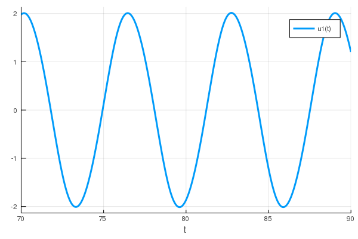

<a id='Continuation-of-limit-cycles-of-the-van-der-Pol-oscillator-1'></a>

# Continuation of limit cycles of the van der Pol oscillator


```julia
using Bifurcations
using Bifurcations: LimitCycleProblem
using Bifurcations.Examples.DuffingVanDerPol

using Plots
using OrdinaryDiffEq: Tsit5, remake
```


Create an [`ODEProblem`][ODEProblem] and solve it:


[ODEProblem]: http://docs.juliadiffeq.org/latest/tutorials/ode_example.html


```julia
ode = remake(
    DuffingVanDerPol.ode,
    p = DuffingVanDerPol.DuffingVanDerPolParam(
        d = 0.1,
    ),
    u0 = [1.0, 1.8],
    tspan = (0.0, 90),
)
sol = solve(ode, Tsit5())

plt_ode = plot(sol, vars=1, tspan=(70, 90))
```





Let's find a point (approximately) on the limit cycle and its period:


```julia
using Roots: find_zero
t0 = find_zero((t) -> sol(t)[1] - 1, (80, 83))
t1 = find_zero((t) -> sol(t)[1] - 1, (t0 + 3, t0 + 7))
x0 = sol(t0)
@assert all(isapprox.(x0, sol(t1); rtol=1e-2))
x0
```

```
2-element Array{Float64,1}:
 1.0000000000000058
 1.822900672704169
```


Then a `LimitCycleProblem` can be constructed from the `ode`.


```julia
num_mesh = 50
degree = 5
t_domain = (0.01, 4.0)  # so that it works with this `num_mesh` / `degree`
prob = LimitCycleProblem(
    ode, DuffingVanDerPol.param_axis, t_domain,
    num_mesh, degree;
    x0 = x0,
    l0 = t1 - t0,
    de_args = [Tsit5()],
)
```


As the limit cycle is only approximately specified, solver option `start_from_nearest_root = true` must be passed to start continuation:


```julia
solver = init(
    prob;
    start_from_nearest_root = true,
)
@time solve!(solver)
```

```
 11.229523 seconds (10.25 M allocations: 1.330 GiB, 9.16% gc time)
BifurcationSolver <Continuous>
# sweeps             : 2
# points             : 35
# branches           : 0
```


By default, `plot_state_space` plots limit cycles colored by its period:


```julia
plt_lc = plot_state_space(solver)
```


